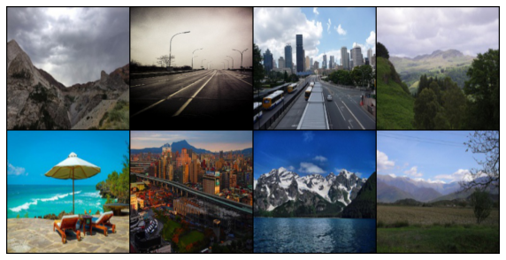
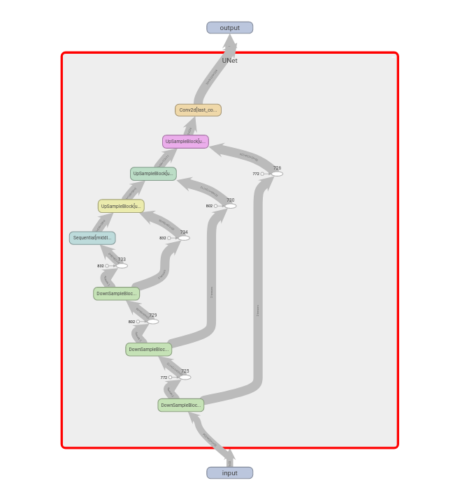

# Development for Data Scientist: 
## Cloud Computing

## Practical Session
In this session, you will train a neural network to colorize black and white images using virtual machines on [Google Colab](https://colab.research.google.com/).  
Colab is normally used to run notebooks. Here, we are going to divert a little its functioning to use it as a cloud computing resource to run our scripts.

You will have to:

* Write your Python scripts on your local machine
* Push your code to your Github repository
* Clone your repository to your Colab instance
* Run your code on Colab
* Monitor your code running on the virtual machine
* Get your results and send them to your local machine 

The solution is available here.  [](https://colab.research.google.com/github/DavidBert/N7-techno-IA/blob/master/code/developpement/colorize_solution.ipynb)  
Try to complete the practical session without looking at it!

## Practical session repository:
If you haven't already done so, fork [this repository](https://github.com/DavidBert/N7-techno-IA) and clone it on your computer.  


## Data

We will be working with the [Landscapes dataset](https://github.com/ml5js/ml5-data-and-models/tree/master/datasets/images/landscapes) composed of 4000 images in seven categories of landscapes (city, road, mountain, lake, ocean, field, and forest).
Instead of using it to train a classifier, we will use it to train a neural network to colorize black and white images.
   
Run the ```download_landscapes.sh``` script to download and extract the dataset.
```bash
./download_landscapes.sh
``` 
The file `data_utils.py` contains some useful functions to load the dataset.

## Development in cloud computing environments
Cloud providers charge by the hour, so cloud computing can quickly get expensive.
A good practice consists of doing most of the code development on your local hardware before sending it to your cloud instances.  
That is what you are going to do in this practical session.  
You will run one small iteration of your code on your local machine to test your code and then send it to your virtual machine.


## The network architecture
We will use a particular category of neural networks to perform the colorization operation: [Unets](https://arxiv.org/abs/1505.04597).  
Initially designed for Biomedical Image Segmentation, Unets offer state-of-the-art performances in many segmentation tasks. These performances are mainly due to the skip connections used in UNets architectures.
Indeed, Unets are a particular form of Auto-Encoders using skip connections between corresponding layers of the encoder and the decoder.
  

The network architecture is defined in the `unet.py` file and need to be completed.    


Help yourself with the above image to implement a Unet network using the template located in the `unet.py` file:

```python
import torch
import torch.nn as nn
import torch.nn.functional as F

def double_conv(in_channels, out_channels):
    # returns a block compsed of two Convolution layers with ReLU activation function
    return nn.Sequential(
        nn.Conv2d(in_channels, out_channels, 3, padding=1),
        nn.ReLU(),
        nn.Conv2d(out_channels, out_channels, 3, padding=1),
        nn.ReLU()
    )   

class DownSampleBlock(nn.Module):

    def __init__(self, in_channels, out_channels):
        super().__init__()
        self.conv_block = ...
        self.maxpool = ...

    def forward(self, x):
        x_skip = ...
        out = ... 

        return out , x_skip

class UpSampleBlock(nn.Module):

    def __init__(self, in_channels, out_channels):
        super().__init__()
        self.conv_block = ...
        self.upsample = ... # use nn.Upsample

    def forward(self, x, x_skip):
        x = self.upsample(x)
        x = torch.cat([x, x_skip], dim=1) # concatenates x and x_skip
        x = self.conv_block(x)
        
        return x
    

class UNet(nn.Module):

    def __init__(self):
        super().__init__()
                
        self.downsample_block_1 = ...
        self.downsample_block_2 = ...
        self.downsample_block_3 = ...
        self.middle_conv_block = double_conv(128, 256)        

            
        self.upsample_block_3 = ...
        self.upsample_block_2 = ...
        self.upsample_block_1 = ...
        
        self.last_conv = nn.Conv2d(32, 3, 1)
        
        
    def forward(self, x):
        x, x_skip1 = ...
        x, x_skip2 = ...
        x, x_skip3 = ... 
        
        x = self.middle_conv_block(x)
        
        x = #use upsampleblock_3 and x_skip3
        x = #use upsampleblock_2 and x_skip2
        x = #use upsampleblock_1 and x_skip1       
        
        out = self.(x)
        
        return out

        
if __name__=='__main__':
    x = torch.rand(16,1,224,224)
    net = UNet()
    y = net(x)
    assert y.shape == (16,3,224,224)
    print('Shapes OK')

```

Check that your network is producing correct outputs by running your file with:
```
python unet.py
```


## Training script
You will now implement the training procedure.  

Training a network to colorize images is a supervised regression problem.  
Consider $x$ a grayscaled image and $y$ its corresponding colored image.
Training a parametrized network $f_\theta$ to predict colorized images $ŷ$ amounts to minimizing the distance between the prediction $ŷ$ and the actual $y$.  
That is to say minimizing $MSE(y, f_\theta(x))$.

Fill the `colorize.py` file following canvas to train a UNet to colorize images (you can inspire yourself from the one in the MNIST example. Be careful, however, in your criterion choice):  

```python
import argparse # to parse script arguments
from statistics import mean # to compute the mean of a list
from tqdm import tqdm #used to generate progress bar during training

import torch
import torch.optim as optim 
from torch.utils.tensorboard import SummaryWriter
from  torchvision.utils import make_grid #to generate image grids, will be used in tensorboard 

from data_utils import get_colorized_dataset_loader # dataloarder
from unet import UNet

# setting device on GPU if available, else CPU
device = torch.device('cuda' if torch.cuda.is_available() else 'cpu')

def train(net, optimizer, loader, epochs=5, writer=None):
    criterion = ...
    for epoch in range(epochs):
        running_loss = []
        t = tqdm(loader)
        for x, y in t: # x: black and white image, y: colored image 
            ...
            ...
            ...
            ...
            ...
            ...
            ...
            ...
        if writer is not None:
            #Logging loss in tensorboard
            writer.add_scalar('training loss', mean(running_loss), epoch)
            # Logging a sample of inputs in tensorboard
            input_grid = make_grid(x[:16].detach().cpu())
            writer.add_image('Input', input_grid, epoch)
            # Logging a sample of predicted outputs in tensorboard
            colorized_grid = make_grid(outputs[:16].detach().cpu())
            writer.add_image('Predicted', colorized_grid, epoch)
            # Logging a sample of ground truth in tensorboard
            original_grid = make_grid(y[:16].detach().cpu())
            writer.add_image('Ground truth', original_grid, epoch)
    return mean(running_loss)
        


if __name__=='__main__':
    parser = argparse.ArgumentParser()
    parser.add_argument('--exp_name', type=str, default = 'Colorize', help='experiment name')
    parser.add_argument('--data_path', ...)
    parser.add_argument('--batch_size'...)
    parser.add_argument('--epochs'...)
    parser.add_argument('--lr'...)

    exp_name = ...
    args = ...
    data_path = ...
    batch_size = ...
    epochs = ...
    lr = ...
    unet = UNet().cuda()
    loader = get_colorized_dataset_loader(path=data_path, 
                                        batch_size=batch_size, 
                                        shuffle=True, 
                                        num_workers=0)


    optimizer = optim.Adam(unet.parameters(), lr=lr)
    writer = SummaryWriter(f'runs/{exp_name}')
    train(unet, optimizer, loader, epochs=epochs, writer=writer)
    writer.add_graph(unet)

    # Save model weights
    torch.save(unet.state_dict(), 'unet.pth')
```

Try to run your code on your local machine for one or two minibatches to check that everything is working.

## Training on cloud instances
You now have everything to run your code on a cloud instance.  
Since we do not have access to free cloud computing ressources in this class, we will use Google Colab to run the code.
Comit and push your code to your GitHub repository.
Go to the following Google Colab notebook and modify the first cell to use your own GitHub repository.
Do not forget to add the following lines in the ```colorize.py``` file within Colab to enable the tensorboard compatibility with Colab.

```python
import tensorflow as tf  
import tensorboard as tb  
tf.io.gfile = tb.compat.tensorflow_stub.io.gfile
```

Then follow the notebook to run your code as a script.

You should be able to access tensorboard.  
Check on your network graph. You should see the U shape of your Unet.


You can now visualize the progression of your network while it is training in the images tab.


Once training is over, download your model's weights on your local machine. We will use them to create the web app.

## Web app with Gradio
Complete the ````colorize_app.py``` file to create a web app that colorizes black and white images and run your application with the following command:  
```bash
python colorize_app.py --weights_path [path_to_the weights]
```	  
You can test your app with random balck and white images from the net. For exemple one of [these](https://www.google.com/search?q=black+and+white+landscape&client=firefox-b-d&sxsrf=ALiCzsaXksCw7fTscNIIIPlJKrwyMkGK_w:1654093215988&source=lnms&tbm=isch&sa=X&ved=2ahUKEwi-ocG0uYz4AhX7gc4BHU5HCh8Q_AUoAXoECAEQAw&biw=1408&bih=624&dpr=1.36).
```bash  
Do you have any idea why the colors are so dull?


